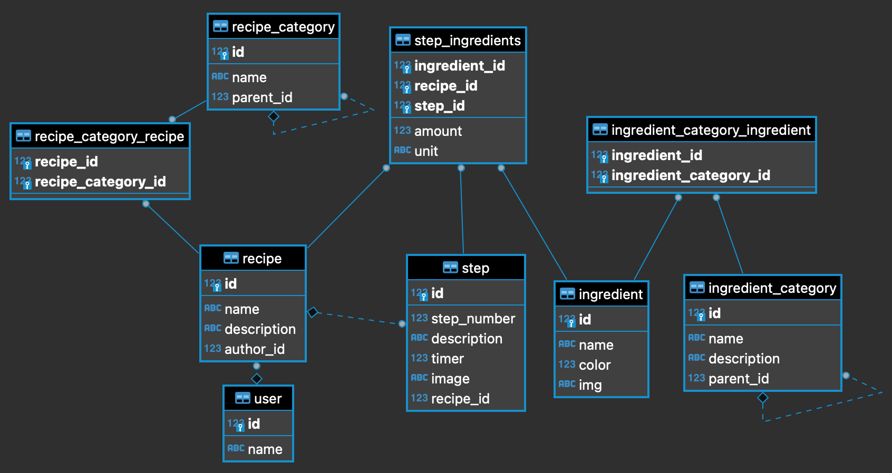

# generous-recipe-service
Full API Doc: [DOCUMENTATION](https://documenter.getpostman.com/view/6786432/UV5WEeAb) 📖

## What's going on here?

- [Features Checklist ✅](#features-checklist-)
- [Stack used 🥞](#stack-used-)
- [How to Run 👟](#how-to-run-)
- [How to Use 💻](#how-to-use-)
    * [List of recipes 🍱](#list-of-recipes-)
    * [Add new recipe 👨🏻‍🍳](#add-new-recipe-)
    * [Add new ingredient 🧂](#add-new-ingredient-)
    * [Add new step for recipe 🍳](#add-new-step-for-recipe-)
    * [Success Response Schema 🍀](#success-response-schema-)
    * [Error Response Schema ❗️](#error-response-schema-)

## Features Checklist ✅

- [x] Using framework 📜
    - [x] MoleculerJS is the choosen one 🥂
- [x] API list of recipes 🍱
    - [x] Paginating 📃
    - [x] Sorting 📈
    - [ ] Field querying 🌱
- [x] API to add new recipe 👨🏻‍🍳
- [x] API to add new ingredient 🧂
- [x] API to add new step for recipe (1 step) 🧪

## Stack used 🥞

- SQLite3
- TypeScript
- MoleculerJS
- TypeORM

## How to Run 👟

- ❗️ Tutorial on this page will cover the step by using `yarn`. If you are using `npm`, please make sure you replace all `yarn` command by `npm run`.

### Clone Repo 💾

Clone this repo using `Download` button or bash 👨‍💻

```bash
$ git clone https://github.com/hrz8/generous-recipe-service.git
```

### Environtment Variable Setup 🛠

Required to create `.env` file for the development purpose, can refer the `.env.sample` file. Create `.env` file for development purpose by this command below:

```bash
$ cd generous-recipe-service
$ touch .env
```

So far, the environment variable that required to be added is the `DB_PATH` only, the rest already covered by default value using the `env-var` library.

| Environtment Variable      | Description |
| -------------------------- | ----------- |
| RESTFUL_PORT               | will be the port of the Restful API server which will serve the services/API.       |
| RESTFUL_PATH               | will be the prefix of the server's URL. Example: `https://host.com{RESTFUL_PATH}/v1/some-app/`. The default will be `/api`.        |
| DB_PATH                    | will be the path of your `.sqlite` database is living, required to set this up.        |

`.env` file should be look like this:

```
RESTFUL_PORT=3000
RESTFUL_PATH=/api
DB_PATH=./path/to/database/db.sqlite
```

### Database Setup ⚙️

After `DB_PATH` been setup, you can run the migration to create and set all tables and also some seeds data for your `sqlite` database by run this commands:

```bash
$ yarn db:sync
$ yarn db:migrate
```

Commands above will create the `database.sqlite` file in your specific `DB_PATH`. Picture below is the Diagram of database used.



### Run Locally 🏃

This command below will compiling the `Typescript` at the first and run the server right after that.

```bash
$ yarn start
```

It will running in the host with the port given `http://host:{RESTFUL_PORT}`.

### Debugging 🕵️‍♂️

Debug app using VsCode Debugger Tool

- Select your debugger to be set as `Launch Debug 🕵️‍♂️`
- Press `F5` to run the debugging
- Done!

## How to Use 💻

Full Doc right here: [DOCUMENTATION](https://documenter.getpostman.com/view/6786432/UV5WEeAb) 📖

### List of recipes 🍱

Endpoint:

| Method | URI                                     |
|--------|-----------------------------------------|
| **GET**    | _{{host}}{{RESTFUL_PATH}}_**/recipe** |

### Add new recipe 👨🏻‍🍳

Endpoint:

| Method | URI                                     |
|--------|-----------------------------------------|
| **POST**    | _{{host}}{{RESTFUL_PATH}}_**/recipe** |

### Add new ingredient 🧂

Endpoint:

| Method | URI                                     |
|--------|-----------------------------------------|
| **POST**    | _{{host}}{{RESTFUL_PATH}}_**/ingredient** |

### Add new step for recipe 🍳

Endpoint:

| Method | URI                                     |
|--------|-----------------------------------------|
| **POST**    | _{{host}}{{RESTFUL_PATH}}_**/recipe/step** |


### Success Response Schema 🍀

```json
{
    "message": "success message",
    "code": 200,
    "apiVersion": "v1",
    "error": null,
    "result": {
        "foo": "bar"
    },
    "meta": {}
}
```

### Error Response Schema ❗️

```json
{
    "message": "error message",
    "code": 400,
    "apiVersion": "v1",
    "error": {
        "name": "ErrorName",
        "type": "ERROR_TYPE",
        "data": {
            "foo": "bar"
        }
    },
    "result": null,
    "meta": {}
}
```

## Author ℹ️

Hirzi Nurfakhrian
